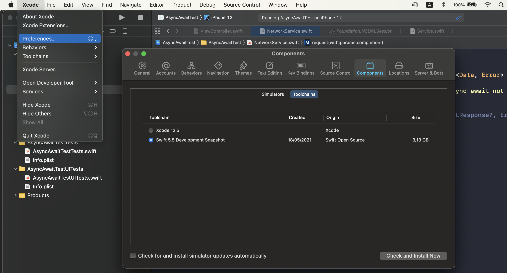

23 May 2021
**Post by:** _Nhat Le_

# First look at Async/Await in Swift
#### Many developers from another langues like C#, JavaScript, TypeScript, ... maybe already familiar with async/await. However, with the Swift language we just have this feature since the proposal [0296-async-await](https://github.com/apple/swift-evolution/blob/main/proposals/0296-async-await.md) get accepted. And at this time when I write this article, async/await still not have release yet, just available via snapshot. We will have this feature when Swift 5.5 get release.

## Setup environment:
+ Xcode 12.5
+ Download and install Swift snapshot from [Swift.org](https://swift.org/download/#snapshots).
+ The open Xcode: Xcode -> Preferences... -> Components -> toolchains -> Swift 5.5 development snapshoot -> Check and install now
+ If you used many Xcode versions, then maybe you will need to remove the Xcode's derived data



## After those steps, let's create a new iOS project for testing async/await feature

In iOS project let's create a `NetworkService` class which will do the network call. Suppose we have a protocol `protocol NetworkService` which have two functions: a compltion callback function and a async funtion

```swift
protocol NetworkService {
  func request(with url: URL, params: [String: Any], completion: @escaping (Result<Data, Error>) -> Void)
  func request(with url: URL, params: [String: Any]) async throws -> Data
}
```

The completion callback is really familiar with all of the iOS developer. So let me explain for the async function:

+ `request(with url: URL, params: [String: Any])` the function accepted two parameters `url: URL` and `params: [String: Any]` 
 + The `async` keyword mean this function will run asynchronous.
 + The `throws` mean this function can throw an error(ex: network connection, bad request,...) and we will need handle error.
 + And finally this function will return `Data` when success

 For someone still not really clear what asynchronous meaning? To explain what it is let take a look at what the familiar keyword synchronous mean:

 >A synchronous function can make a call; when it does, the function immediately waits for the call to complete. Once the call completes, control returns to the function and picks up where it left off

Same as the synchronous

 > asynchronous function: it can make calls as usual; when it does, it (normally) immediately waits for the call to complete. Once the call completes, control returns to the function and it picks up where it was

 The only difference is that:
 >synchronous functions get to take full advantage of (part of) their thread and its stack, whereas asynchronous functions are able to completely give up that stack and use their own, separate storage

 Now let do the implementation for those above methods:

 ```swift
 func request(with url: URL, params: [String: Any], completion: @escaping (Result<Data, Error>) -> Void) {
    URLSession.shared.dataTask(with: url) { data, _, err in
      if err != nil {
        completion(.failure(err!))
      } else {
        completion(.success(data!))
      }
    }.resume()
  }
  
  func request(with url: URL, params: [String: Any]) async throws -> Data {
    guard #available(iOS 9999, *) else {
      throw NSError(domain: "test", code: 0, userInfo: ["errorMessage": "async await not available"])
    }
    ///It'll better if function:
    ///func dataTask(with url: URL, completionHandler: @escaping (Data?, URLResponse?, Error?) -> Void) -> URLSessionDataTask
    /// support async. So we can return
    /// return URLSession.shared.dataTask(with: url)
    /// Instated of using `withUnsafeThrowingContinuation`
    return try await withUnsafeThrowingContinuation({ continuation in
      URLSession.shared.dataTask(with: url) { data, _, err in
        if err != nil {
          continuation.resume(throwing: err!)
        } else {
          continuation.resume(returning: data!)
        }
      }.resume()
    })
  }
 ```

 As my comments for the async function, currently it's still verbose when compared with the completion callback function. But hope we will have a better function `dataTask(with:...` which support async. 
 We done the implementation for service class. So let's make a request to get data. For simple I load the request inside a view controller:

 ```swift
 func doAsyncMethod() async {
    do {
      let url = URL(string: "https://vnexpress.net")!
      let data = try await service.request(with: url, params: [:])
      print("doAsyncMethod Result success: \(String(describing: String(data: data, encoding: .utf8)))")
    } catch let err {
      print(err.localizedDescription)
    }
  }
  
  func doCompletionCallBackMethod() {
    let url = URL(string: "https://vnexpress.net")!
    service.request(with: url, params: [:]) { result in
      switch result {
      case let .success(data):
        print("doCompletionCallBackMethod Result success: \(String(describing: String(data: data, encoding: .utf8)))")
      case let .failure(err):
        print(err.localizedDescription)
      }
    }
  }
 ```

 And at `ViewDidLoad` let compare what is different when make a asynchronous call between `async` vs `completion callback`:
 ```swift
 override func viewDidLoad() {
    super.viewDidLoad()
    /// Call async function
    if #available(iOS 9999, *) {
      detach {
        await self.doAsyncMethod()
      }
    } else {
      // Fallback on earlier versions
    }
    
    /// Call completion callback (closure)
    doCompletionCallBackMethod()
  }
 ```

Yes, we cannot make a directly call `asynchronous` function inside the `synchronous` function, so we need `detach {...}`. As we can see, to make a asynchronous call currently it's still verbose.

## Future
Let's way for the first Xcode beta version will include async/await feature to see what will get improve?(mabe at WWDC time - 07/June)

 Let's hope for better version when async/await get release 👨‍💻
 
 Happy coding! 🎉